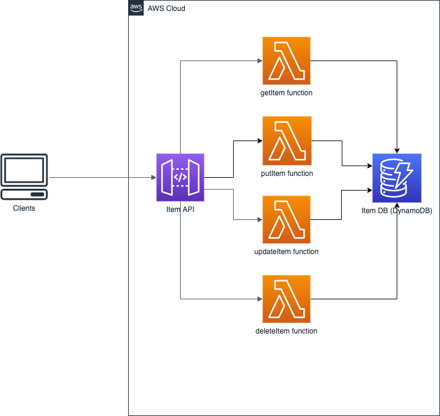

## AWS Proton

Proton is an AWS service that is aimed at infrastructure as code and uses CloudFormation, but its major difference to other services is decoupling of infrastructure and code. Proton introduces two entities in its setup:

* Service. It is an AWS resource or set of resources that usually focused on business logic and contain custom developer code. Any repeatable item in an AWS application can be considered as a Proton service instance (e.g. Lambda handler in multi-lambda environment or Fargate containers in microservices architecture). In addition to infrastructure, the Proton service instance may have its own CodeDeploy pipeline and webhook established during the creation of a service instance, so custom code will be automatically built and deployed to a service instance. Proton service instances can be created only inside a Proton environment.
* Environment. It is a set of shared resources and policies which are shared across service instances that are created in this environment (common DB, API Gateway, VPC, etc.).

Both Service and Environment are created from Proton templates — it is a proton-specific file structure that uses CloudFormation to define resources for an environment (environment template), service (service template), and code pipeline for service (optional, included into service template).
Both Service and Environment can consume arguments from custom parameters which can be defined in a template (similar to CloudFormation parameters) and this is how several instances with small differences can be created from a single template.

## About this project

Please find the detailed description at my [Medium blog post](https://medium.com/@rostyslav.myronenko/aws-proton-101-and-detailed-code-example-29c816bdd361)

This repository represents Proton configuration to establish the following simple Serverless architecture:
- Dynamo DB Table
- Lambda handlers
- API Gateway



Lambda handlers are attached to API Gateway (AWS_PROXY integration) and can interact with Dynamo DB.

As Proton entities, resources above are grouped as:
- Proton Environment: Dynamo DB and API Gateway. It is a shared infrastructure which can be created from Proton Environment Template ("environment" folder).
- Proton Service: Lambda handlers. It is handlers created from Proton Service template ("lambda-service" folder) which work inbetween API Gateway and Dynamo DB in a particular environemnt. 


## Build

To create Proton Environment template, create a tar.gz archive with content of "environment" folder:
```
tar -cvzf my-proton-environment-template.tar.gz environment/
```
To create Proton Service template, create a tar.gz archive with content of "lambda-service" folder:
```
tar -cvzf my-lambda-service-template.tar.gz lambda-service/
```
Use both archives to create Proton Environemnt and Services via console or CLI. Read how to create both at https://docs.aws.amazon.com/proton/latest/adminguide/ag-getting-started-console.html and https://docs.aws.amazon.com/proton/latest/userguide/ug-get-started-console.html

## License

This library is licensed under the MIT-0 License. See the LICENSE file.

